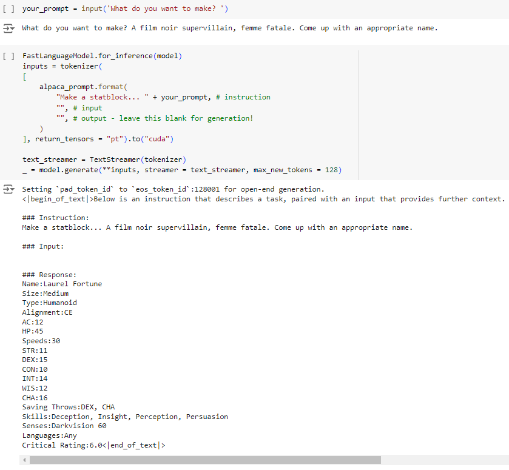

# Dungeons & Dragons Race Classification > [Go to project](https://github.com/tophercollins/dnd-statblock-generator)

## Aim

This project aims to use the Llama 3 8B LLM to create a fine-tuned task specific model for creating Dungeons & Dragons monster statblocks in a structured style and format.

## Data

The original monster data can be found at [D&D Monster Spreadsheet](https://docs.google.com/spreadsheets/d/16-zbSZFj-k4uYxgu1nFkKyhEG8rE2ZkO5oiQX3tLMkE/edit?usp=sharing)

The processed data for fine tuning can be found at [D&D Monster Hugging Face Dataset](https://huggingface.co/datasets/tophercollins/dnd_monster_sample)

## Process

* We simplied the dataset, removing features that aren't required such as 'Author', 'Url', & 'Font', and some because they wouldn't teach us anything more about our model.
* Randomly selected 20 samples to produce our baseline model.
* Produced a prompts column for each sample through a combination of manual writing and LLM generation.
* Converted our data into format for fine-tuning: instruction (prompts), input (empty strings currently, but could be used for websites or specific stats), & output (monsters data in desired structure).
* Pushed the dataset to Hugging Face for integration with Hugging Face datasets API.
* Set up a Google Colab environment with Torch, Unsloth (for efficient fine-tuning), Xformers, and all other packages.
* Set up Unsloth's Llama3 8b for base model and LoRA adapters for fine-tuning.
* Trained our model and tested on simple prompts (with no specific) and targetted prompts (requiring specific info included in statblock).
* Saved our model locally and pushed LoRA adapters to Hugging Face.

## Conclusion

Our output results consistently followed the desired output format. As such, we could easily take the model outputs and process them for further needs, such database storage or provding directly to a user. There were some signs of overfitting, which is understanble with our very small fine-tuning dataset. In particular the 'creativity' of the model seems limited, often producing a name that is extremely uniform and basic.

Model LoRA adaptors can be found and used [here](https://huggingface.co/tophercollins/dnd_statblock_generator_lora_model)
