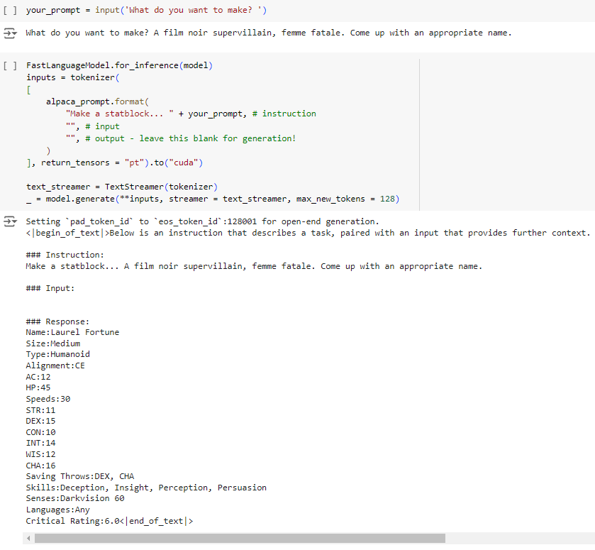

## Portfolio

I'm an **analytics engineer and full-stack AI product builder**. Professionally I build production data platforms - **dbt** transformation layers, **Airflow / Google Cloud Composer** orchestration, **BigQuery** warehousing and custom REST-API integrations across a couple of dozen advertising-platform sources. Alongside that I design and ship full-stack, AI-powered products end to end. I came up through data science and machine learning, so those projects are here too.

### Featured product
- [History Check - record, transcribe & AI-track your RPG campaign](#history-check)

### Products & Engineering
- [Analytics Engineering (dbt · Airflow · BigQuery)](#analytics-engineering)
- [DnDwithToph.com](#dndwithtoph)
- [DnDwithToph Exploratory Data Analysis](#dndwithtoph-eda)
- [Zombie Survival Game](#zombie)

### AI / Data Science
- [Fine-tuning LLM for RPG Statblocks](#rpg-statblock-generator)
- [Handwritten Character Recognition / Automated Scorecard Processing](#handwritten-character-recognition)
- [Smoker vs. Non-Smoker Classification](#smoker-classification)
- [Red Card / Goal Exploratory Data Analysis](#red-card-goal-analysis)
- [EIFO Data Extraction](#eifo-data-extraction)
- [Electric Vehicle kWh Consumption Forecasting](#ev-kwh-consumption-forecasting)
- [Bitcoin Price Forecasting](#bitcoin-price-forecasting)
- [Structured Medical Text Classification with NLP](#medical-text-classification)
- [Transfer Learning in Food Image Classification](#food-image-classification)
- [Dungeons & Dragons Race Classification using Scikit-learn](#dnd-race-classification)

---

## Featured product

### [History Check](https://historycheck.app) - *Your campaign never forgets.*

A web-first app for tabletop-RPG Game Masters that **records a session, transcribes it, and uses AI to do the bookkeeping** - generating summaries and automatically extracting the NPCs, locations, items, monsters and organisations that came up, then tracking them across an entire campaign. Built solo, end to end.

- **Frontend:** **Flutter** web (Dart), **Riverpod** state management, `go_router`, responsive layout.
- **Audio capture:** in-browser recording via the **MediaRecorder API** (Opus), chunked and uploaded incrementally so a GM can close the browser mid-session and lose nothing; crash/refresh recovery reconciles the local cache against cloud storage.
- **Backend:** **Supabase / PostgreSQL** as the single source of truth via PostgREST, with **row-level security** enforcing a multi-user owner/viewer (GM/player) permission model, token-based invite links, and `SECURITY DEFINER` RPCs.
- **AI pipeline:** a fully **server-side** pipeline on **Deno edge functions** - audio → **AssemblyAI** transcription (speaker diarization) → **Google Gemini** for structured (JSON-schema) summarisation and entity extraction. API keys stay server-side.
- **Production engineering:** **Sentry** observability, Supabase **Realtime** status updates, a **Paddle/Stripe** billing & feature-gating layer, separate staging/production environments and deploy pipelines, and **1,100+ Flutter tests** plus ~70 edge-function test files.

> Flutter · Dart · Supabase · PostgreSQL · Deno · TypeScript · AssemblyAI · Google Gemini · Next.js · Sentry · Paddle

*The in-app AI "Historian" answering a question about the campaign, beside the world database of auto-extracted entities.*

---

## Products & Engineering

### Analytics Engineering - dbt · Airflow · BigQuery

Professional work building and maintaining production data platforms on Google Cloud.

- Orchestrated data pipelines on **Airflow / Google Cloud Composer**, running both **dbt** transformations and custom business-logic DAGs.
- Ingested from ~two dozen advertising-platform sources through **custom REST-API integrations**, landing raw data into **BigQuery**.
- Built and tested modelled, business-ready data with **dbt** (staging → marts), with schema/data tests guarding correctness.
- Worked across the stack in **Python 3.11** and **SQL**, plus agentic-AI tooling layered on top of the data platform.

---

[DnDwithToph.com](https://dndwithtoph.com)
- **Flask** framework with **SQLAlchemy** database management
- User Authentication and Session Management
- User-Generated Content following **CRUD** principles
- Production Server Deployment with **Gunicorn** and **Git** Version Control

---

[DnD with Toph Exploratory Data Analysis](/dndwithtoph-eda.md)
- A financial assessment and report for 'DnD with Toph', an online Dungeons & Dragons adventure service, using Python and **Pandas** to clean, transform, and analyze the data.
- Used data to observe growth and profit trends to optimise future scheduling and projects.
- Skills include **Data Manipulation & Analysis** using Python & Pandas and **Data Visualization** with **Matplotlib**.

---

[Zombie Survival Game](/zombie-survival.md/)
- Developed a Python-based Zombie Survival Game, the mechanics involve managing resources, mission outcomes, and end-of-day round Zombie attacks.
- **Object-oriented programming** in Python to create Class Models for Camp, Locations, and Players.
- Utilized smaller functions for specific game mechanics and larger functions to implement and run game flow, mission outcomes, and end-of-round events.
- Employed **random library** and computer decision logic trees for computer-controlled players.

---

## AI / Data Science

[Fine-tuning LLM for RPG Statblocks](/rpg-statblock-generator.md)

- Created a **Fine-tuned** task specific model using Llama3 and Unsloth to create Dungeons & Dragons statblocks and game elements.
- Deployed on Hugging Face for accesible Training Dataset and LoRA Fine-tuned Adaptors.

---

[Handwritten Character Recognition/Automated Scorecard Processing](/handwritten-character-recognition.md)

- Created a Convolutional Neural Network in TensorFlow to predict the class of a handwritten character.
- Artificially constructured characters with a strikethrough.

- Used measures to avoid overfitting a Computer Vison task, such as Dropout, Batch Normalization, Kernal Regulization, and Data Augmentation.
- Achieved a 99% prediction accuracy on the test data.
- Model deployed for real world application of Education Scoresheet recogniton.

---

[Smoker vs. Non-Smoker Classification](/smoker-classification.md)

- Created a Neural Network Stacking Classifier using Scikeras KerasClassifier and Scikit-learn's StackingClassifier.
- Used analysis of feature outliers and distrubtion to improve feature engineering.

- Combined Catboost, XGBoost, LightGBM and Random Forest Classifier models to create a balanced ensemble model.
- Utilized Tensorflow 2.0 Sequential Neural Network for improved ensemble weights.
- Achieved a final score of 0.87583 (compared with best of 0.87946), placing 283 out of 1910 submisions.

---

[Red Card / Goal Exploratory Data Analysis](/red-card-goal-analysis.md)

- Processed and analyzed data across 20,000 European Football matches, using Pandas for data cleaning, feature engineering and data analysis.
- Conducted hypothesis testing with statistical models, including Poisson Means Tests and Linear Regression, to assess the relationship between red cards and goal-scoring.
- Visualized distribution patterns and event correlations using Matplotlib and Seaborn.

---

[EIFO Data Extraction/Web Scraping](/eifo-data-extraction.md)

- Built a Python script to extract country risk and cover polcies from EIFO website.
- Used BeautifulSoup and Selenium (for dynamic website features) for data selection and extraction.
- Cleaned and transformed data in Pandas.
- Exported data to Excel output sheet.

---

[Electric Vehicle kWh Consumption Forecasting](/ev-kwh-consumption-forecasting.md)

- Explored forecasting daily kWh consumption for a workplace EV charging program and implemented naive, neural network, and LightGBM prediction models.

---

Bitcoin Price Forecasting

- Implemented time series models (Conv1D, Bidirectional LSTM, GRU) for Bitcoin price forecasting, using metrics (Loss, MAE, MSE) to assess performance.

---

Structured Medical Text Classification with NLP

- Developed a multi-class NLP model utilizing Universal Sentence Encoder, Conv1D character embedding, and text position features to classify medical literature sentences, enhancing readability with structured paragraphs based on classification headings.

---

Transfer Learning in Food Image Classification

- Developed computer vision model on Food101 dataset utilizing EfficientNetV2 transfer learning to achieve over 80% accuracy in categorizing 101 types of food images.

---

[Dungeons & Dragons Race Classification](/dnd-race-classification.md)

- Utilized **Machine Learning** techniques with **Scikit-learn** to predict character races based on ability scores and features from a Dungeons & Dragons dataset.
- Explored various models for selection, **Random Forest**, **Logistic Regression**, **Support Vector Classifier (SVC)**, **K-Nearest Neighbors (KNN)**, and **AdaBoost Classifier**.

- Conducted in-depth **feature analysis** and **model evaluation**.
- Fine-tuned hyperparameters of the best performing classfier through manual tuning, **RandomizedSearchCV** and **GridSearchCV**.
- Achieved an **accuracy of 67.25%** in predicting character races, improving on **51.8%** from the initial dataset.

---
